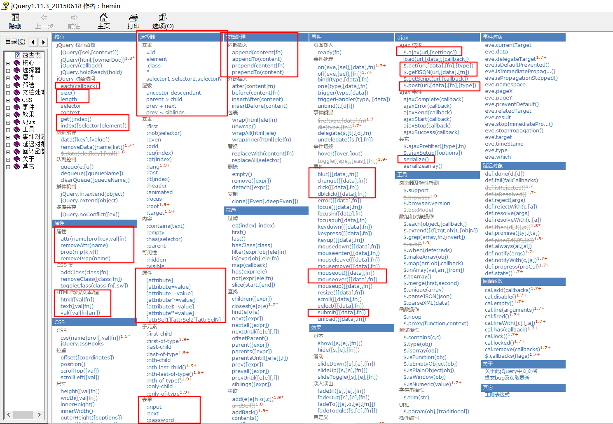

## JavaScript

> 写前声明：JavaScript这个章节难理解点较多，通常学生就算能记住基本语法、常用事件、常用DOM操作但是由于对一些概念不理解、对一些基本思想不够重视导致对知识的错误应用，因此本文主要解决这些问题，以及对一些重点知识的总结，基本语法不再赘述。另外，提醒初学者，JavaScript及jQuery所学知识点都极易遗忘，不要因此恐慌，平常多回头敲敲案例，多复习一下，jQuery的API文档平常没事多翻翻看看就行了。

### JavaScript对象★★★

> JavaScript对象在JavaScript中也属于高级内容，若深入讲解的话比较复杂难懂，此处只做简要介绍，对其有个大概的了解，若想深入了解，请自己专研。

* 定义：ECMA-262把对象定义为：“无序属性的集合，其属性可以包含基本值、对象或者函数”。

* 对象的几种定义格式：

  ```javascript
  第一种：
  var person = new Object();
  person.name = "Nicholas";
  person.sayName = function(){
    alert(this.name);
  }
  调用方式：
  person.sayName();

  第二种(对象字面量语法，较为流行)：
  var person = {
    name: "Nicholas",
    sayName: function(){
      alert(this.name);
    }
  }
  ```

* JavaScript中的对象分为内建对象与宿主对象(抛开用户自定义对象不谈)

  * 内建对象：JavaScript语言本身包含的对象，例如Math，Array，Date等(JavaScript的内建对象类似于Java就相当于Java的JDK)。
  * 宿主对象：宿主对象不是由JavaScript语言本身而是由它的运行环境提供的。具体到Web应用，这个环境就是各种Web浏览器。由Web浏览器提供的预定义对象被称为宿主对象。(类比Java，就相当于在eclipse创建项目后引入Tomcat服务器的依赖jar包，例如HttpServlet这些不属于JDK里面的类而是属于Tomcat依赖jar包中的类)。

* 与宿主对象相关疑难点解释

  **问：**在js代码中，为什么获取一个标签对象后就可以通过对象"点"属性的方式获取该属性所对应的属性值呢？如下示例代码：

  ```html
  <script>
    onload = function(){
      var ttt = document.getElementById("ttt");
      alert(ttt.name+","+ttt.value+","+ttt.test);
    }
  </script>
  <input type="text" id="ttt" name="username" value="zs" test="test" />
  ```

  执行上面的代码弹出框会弹出` username,zs,undefined` ，上述代码首先通过`document.getElementById("ttt")` 获取input标签所对应的js对象，然后通过对象"点"属性的方式(ttt.name)取值，根据弹出框结果可以看出，name与value都是可以取出对应的值的，但是test却没有，这是为什么呢？

  **解释：** 在web浏览器中，几乎对所有的HTML标签，都会对应着给它们预置了js对象，也就是宿主对象，为了方便获取标签中的属性值，又在宿主对象中内置了常用属性，比如input标签就有与其对应的js对象，该对象中预置了text、id、name、value等等属性，所以用户可以通过对象点属性的方式去获取属性值，但是，该对象中并没有预置test属性，因此是无法通过对象点属性的方式获取其对应值的(可以通过`ttt.getAttribute("test")` 的方式获取)。

### JavaScript中常用的DOM元素操作★★★★★

* `var demo = document.getElementById("id")`
  * 根据标签中设置的id值来获取对应的标签对象，注意此处为Element，是“元素”的单数形式，因此获得的直接就是元素对象了，获取过之后可以直接通过demo"点"的方式获取属性值或绑定事件。
* `var demo = document.getElementsByClassName("classname")`
  * 根据标签中设置的class属性值来获取对应标签对象的集合数组，注意此处是Elements，是“元素”的复数形式，因此直接获得的是一个数组，要想对标签对象进行操作，需要先遍历该数组取到标签对象后再操作。与其相似的还有`document.getElementsByTagName("tagname")` (根据标签名获取)、`document.ElementsByName("name")` (根据name属性值获取)。
* `元素对象.appendChild(元素对象)`
  * 在一个元素标签对象内拼接一个子标签对象。
* `document.createElement("")`
  * 在js中动态的创建一个标签对象，例如：`document.createElement("a")` 创建一个a标签对象。
  * 仅仅创建一个标签对象是无法在页面展示的，需要结合`appendChild()` 方法将本对象拼接与页面已存在的标签对象产生关联才能做到在页面上展示。
* `元素对象.remove()` 
  * 通过remove方法删除某个标签对象。
* `元素对象.innerText`
  * `var i =元素对象.innerText ` 获取该标签及其该标签的后代标签内所有的文本内容。
  * `元素对象.innerText = "文本内容" ` 往当前标签内插入文本内容。
* `元素对象.innerHTML`
  * `var i =元素对象.innerHTML`获取该标签及其该标签的后代标签内所有的标签及文本内容。
  * `元素对象.innerText = "标签及文本内容" `往当前标签内插入标签及文本内容。

### 事件绑定★★★★★

> 一定要对事件绑定的写法格式牢记于心，不可与后面的jQuery的写法混淆！！！

* 常用写法一：在HTML上进行事件绑定

  ```html
  <script>
          function fn() {
              alert("我被触发啦~~")
          }
   </script>
   <input type="button" id="btn" value="点击我" onclick="fn()" />
  ```

* 常用写法二：在JavaScript中进行事件绑定

  ```html
  <script>
          window.onload = function () {
              var btn = document.getElementById("btn");
              btn.onclick = function () {
                  alert("我被触发啦~~");
              }
          }
   </script>
  <input type="button" id="btn" value="点击我" />
  ```

  **注意：** 新手最容易在此处出问题，漏写文档加载事件onload，错误代码完整展示如下：

  ```html
  <!DOCTYPE html>
  <html lang="en">
  <head>
      <meta charset="UTF-8">
      <title>Title</title>
      <script>
        var btn = document.getElementById("btn");
        btn.onclick = function () {
          alert("我被触发啦~~");
        }
      </script>
  </head>
  <body>
   <input type="button" id="btn" value="点击我" onclick="fn()" />
  </body>
  </html>
  ```

  **错误分析：** 因为文档流是从上往下加载的，加载完第一行加载第二行，当加载到JavaScript代码的时候执行JavaScript代码，因为在此处JavaScript代码块定义在了文档头标签`<head></head>`中,当程序执行`var btn = document.getElementById("btn");` 时，还并未读取到下方的输入框标签，因此这时候程序根本不知道id值为btn的标签对象到底是谁，对象找不到，点击事件自然也绑定不成功了。

### 数组的两种遍历方式★★

- 对于非自己创建的js对象进行遍历时尽量使用普通for循环进行遍历。普通for循环只能遍历出角标为数字的值

- 对于是自己创建的，既含有数字角标，又含有字符串角标的js对象进行遍历时使用增强for循环进行遍历。增强for循环既可以遍历出角标为数字的值也可以遍历出角标为字符串的值。

  ```HTML
  <script type="text/javascript">
    var arrs = new Array(4,8,90);
    arrs["first"] = "test1";
    arrs["second"] = "test2";
    //输出数组的长度
    alert(arrs.length);
    //普通for循环进行数组的遍历
    for(var i = 0;i < arrs.length;i++){
      alert("数组中角标为"+i+"的元素对应的值是："+arrs[i]);
    }
    //增强for循环进行数组的遍历
    for(i in arrs){
      alert("数组中角标为"+i+"的元素对应的值是："+arrs[i]);
    }
  </script>
  ```

  ​

### 前端遇到BUG的处理思路★★★★★

> 如果你刚接触前端知识，之前对其一无所知，在前端遇到问题后总是找很久还找不到错误在哪里，那么，强烈建议你按照我下面讲的解决BUG的思路来，步骤虽然少、简单，但是有用没用，一试便知。

* 核心步骤总结：三步走加两明确
* 前端问题的一般体现：预期结果与实际不相符
  - 第一步：F12打开调试界面查看是否有报错，若报错状态码为404，且报错信息中包含：http://127.0.0.1:8020/favicon.ico链接，则忽略该错误即可。
  - 第二步：若调试界面中无错误信息，则调试相关函数，查看函数是否真的被调用了，如点击事件调用的函数。如何测试相关函数？在函数的第一行添加一个alert（）或者console.log()都行。
  - 第三步：若函数也确实被调用了，但是预期结果与实际还是不相符，那么十有八九就是代码逻辑有问题。
  - 一明确：明确自己写的每一步是什么意思，然后再跟着代码一步步的进行分析，这样大部分的错误都能够被解决。
  - 二明确：明确程序流是怎样的从上往下执行的。

## jQuery

> 学习jQuery这块一定要弄清楚jQuery对象和JavaScript原生对象两者到底存在什么样的关系，千万不要将两者混淆，多写点代码，看下两者的区别到底是什么，若是这里弄不清楚，那么用起JavaScript与jQuery难免会错误百出。

### JavaScript原生对象与jQuery对象的转换★★★★★

```html
<input type="button" id="btn" value="这是一个按钮"/>
<input type="text" class="tt" value="文本输入框1"/>
<input type="text" class="tt" value="文本输入框2"/>
<input type="text" class="tt" value="文本输入框3"/>
<input type="text" class="tt" value="文本输入框4"/>
```

- JavaScript：
  - 通过id获取一个对应的对象
    - `var btn = document.getElementById("btn");`
    - 获取之后即为一个对应的元素对象，可以直接通过btn.value获取该对象中对应的value值。
    - JavaScript元素对象转jQuery对象：`$(btn)`
    - 绑定事件：`btn.onclick = function(){}`
  - 通过class获取多个对应的对象
    - `var tt = document.getElementsByClassName("tt");`
    - 获取之后为一个数组对象，需要通过遍历获取其中的每个元素对象，之后才能获取该对象中对应的value值。
    - JavaScript元素对象转jQuery对象：`$(tt)` 。
    - 绑定事件：必须先遍历，之后再绑定。
- jQuery：
  - 通过id获取一个对应的jQuery对象
    - `var btn = $("#btn");`
    - 获取之后为一个jQuery对象，要想获取该对象中的value值，那么就应该用对应的jQuery的方式进行获取，即：`$("#btn").val()` 。
    - jQuery对象转JavaScript元素对象：`$("#btn")[0]`
    - 绑定事件：`$("#btn").click(function(){})`
  - 通过class选择器获取一个对应的jQuery对象
    - `var tt = $(".tt");`
    - 获取之后为一个jQuery对象，而这个jQuery对象中包含多个原生JavaScript元素对象，若是直接使用`var tt = $(".tt").val()`，那么只能获取第一个元素对象对应的value值，若是要获取所有的value值，必须要对该jQuery对象进行遍历获取每个元素对象后再获取其value值。但是，若是对这一组元素对象进行事件的绑定时，直接采用`tt.click(function(){})`绑定即可，不需要遍历获取每个元素后再进行绑定。
    - jQuery对象转JavaScript元素对象：`$(".tt").each(function(){alert(this.value)})`。
    - 绑定事件：`$(".tt").click(function(){}) ` 可进行事件的批量绑定。

### this与jQuery之间的关系★★★★

```html
<script src="../jquery-1.11.3.js" type="text/javascript" charset="utf-8"></script>
<script type="text/javascript">
  $(function(){
    $(".tt").click(function(){
    	alert(this.value);
    });
  });
</script>
<input type="button" id="btn" value="这是一个按钮"/>
<input type="text" class="tt" value="文本输入框1"/>
<input type="text" class="tt" value="文本输入框2"/>
<input type="text" class="tt" value="文本输入框3"/>
<input type="text" class="tt" value="文本输入框4"/>
```

在上面代码的事件绑定中this与当前jQuery对象的关系？

- 通过上述代码，可以实现对含有类名为tt的元素对象进行点击事件的绑定，但是绑定后函数的执行是在点击事件发生的才执行的，当点击时，点击哪个元素节点那么this就代表哪个元素对象，因此，课上讲的**谁调用函数，那么this就代表谁在此处仍然适用**

### jQuery中必会API总结★★★★

> 由于API文档上面解释的很详细，而且有具体的实例可以测试，因此在这里我就不再赘述，只将重点API圈出，具体见下图。



### 其他注意事项★★★

- JavaScript中进行字符串内容比较时，直接用==进行比较即可，**JavaScript中没有equals()方法！！**
- JavaScript中可以用Location.href = "URL网址" 的方式进行跳转链接，当程序走到这里时就会自动进行链接跳转。
- 关于对一个标签绑定多个相同事件的状况分析
  - 在标签中直接绑定两个相同的事件，那么每次执行的时候只会执行第一个绑定的事件
  - 用原生js的方式对一个标签同时绑定两个相同的事件，后绑定的事件始终会覆盖先绑定的事件（先绑定的事件中的方法是不会执行的）
  - 用jQuery的方式对一个标签同时绑定两个相同的事件，那么按照绑定事件的先后顺序去执行方法。