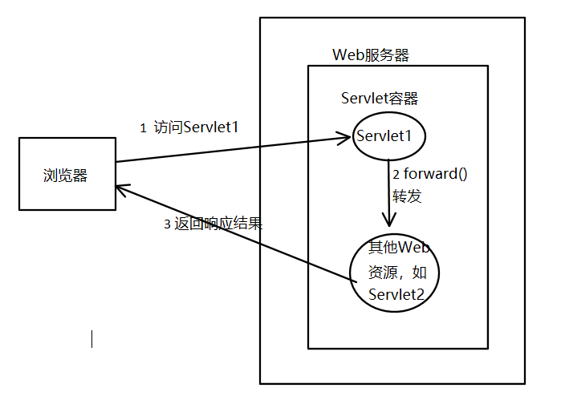
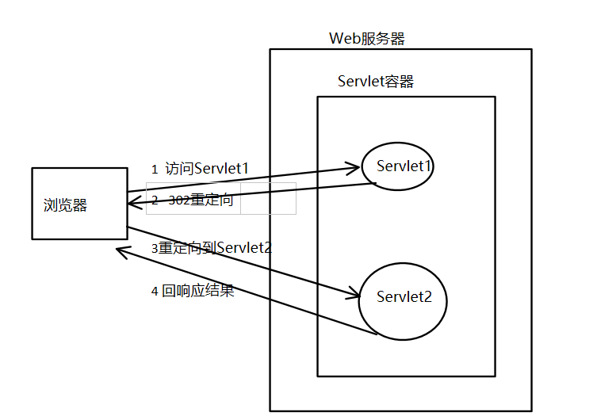

## HttpServletRequest对象

###  常用方法★★★★★

* String request.getParameter(String name)

  * 该方法用于获取某个指定名称的参数值，如果请求消息中没有包含指定名称的参数，getPrameter()方法返回null；如果指定名称的参数存在但没有设置值，则返回一个空串；如果请求消息中包含有多个该指定名称的参数，getPrameter()方法返回第一个出现的参数值。
* String getMethod()
  * 该方法用于获取HTTP请求消息汇总的请求方式（如GET，POST等）。
* String getContextPath()
  * 该方法用于获取请求URL中属于WEB应用程序的路径，这个路径以"/"开头，表示相对于整个WEB站点的根目录，路径结尾不含"/"。如果请求URL属于WEB站点的根目录，那么返回结果为空字符串("")
* String setCharacterEncoding()
  * 该方法用于设置request对象的解码方式。默认情况下只对POST请求乱码有效。
* HttpSession getSession()
  * 返回与这个请求对象联系的当前session对象，如果这个请求没有一个session，就创建一个。
* Cookie[]  getCookies()
  * 返回一个客户端通过当前request请求携带来的包含所有cookie对象的数组。

#### 作为域对象

**request作为域对象时，其域对象范围为一次请求中有效**

> 思考：这是接触的第二个域对象，那么你还记得第一个域对象是谁吗？你能说出两个域对象的区别吗？若我在request域中存储了数据之后接着来了一个重定向，那么重定向后的页面还能获取到request域中的数据吗？ServletContext域呢？好好想一想~~

##### 常用方法

* setAttribute()方法
  * 该方法用于将一个对象与一个名词关联后存储进ServletRequest对象中
* getAttribute()方法
  * 该方法用于从ServletRequest对象中返回指定名称的属性对象。

##### 其他方法

* removeAttribute()
  * 该方法用于从ServletRequest对象中删除指定名称的属性
* getAttributeNames()
  * 该方法用于返回一个包含ServletRequest对象中所有属性名的Enumeration对象，在此基础上，可以对ServletRequest对象中的所有属性进行遍历处理。

#### RequestDispatcher接口★★★★★

##### 常用方法

* getRequestDispatcher(String path)
  *  返回封装了某个路径所指定资源的RequestDispatcher对象。其中，参数path以"/"开头时，用于表示当前Web应用的根目录(即：localhost:8080/项目名/)。需要注意的是，WEB-INF目录中的内容对RequestDispatcher对象也是可见的，因此，传递给getRequestDispatcher(String path) 方法的资源可以是WEB-INF目录中的文件。若不加"/"，代表相对路径，相对于当前Servlet所在路径进行拼接。当为相对路径时，`reqeust.getRequestDispatcher("jsp/index.jsp")`,当前Servlet的层级路径为`localhost:8080/项目名/ttt/test` 那么转发的路径就为` localhost:8080/项目名/ttt/jsp/index.jsp` 。
* forward(ServletRequest request,ServletResponse response)
  * 该方法用于将请求从一个Servlet传递给另外的一个Web资源。在Servlet中，可以对请求做一个初步处理，然后通过调用这个方法，将请求传递给其他资源进行响应。需要注意的是，该方法必须在响应提交给客户端之前被调用，否则将抛出IllegalStateException异常

##### 其他方法

* include(ServletReqeust reqeust,ServletResponse response)
  * 该方法用于将其他资源作为当前响应内容包含进来。

### 重定向和转发的区别★★★★★

* 转发如下图：

* 重定向如下图：

* 区别：**请求转发**  客户端只发出了一次请求，到了Servlet1产生过request对象与response对象后即便请求转发到了下一个Servlet2(或者jsp)request及response对象还是没变  **重定向** 首先客户端发出一个请求到达Servlet1，这时候产生了request对象及response对象，当重定向后浏览器再次向服务器发出一次新的请求，这时候又会产生一个新的request对象和一个新的response对象
  * 重定向的地址栏会发生变化，转发的地址栏不变
  * 重定向两次请求两次响应，转发一次请求一次响应
  * 重定向路径需要加工程名，转发的路径不需要加工程名
  * 重定向可以跳转到任意网站，转发只能在服务器内部进行转发
* 看完重定向与转发的区别后不知道你有没有对上面那个思考题能够自己做出来，而且有一个清晰的解释，若是先把数据存在request域，然后进行重定向，因为重定向时会再次发出一次新的请求，当重定向会目标页面后，此时的request及response对象就不再是原来那两个了，因此将数据存储到request域再进行重定向的话，会造成数据遗失，存储无效的结果。但是，若是将数据存储到ServletContext域，因为ServletContext域范围为整个应用，只要当前web应用正常运行，数据就不会自动遗失，就可以从中取出数据。

### 其他重点方法

* String[] getPrameterValues(String name)
  * HTTP请求消息中可以有多个形同名称的参数（通常由一个包含有多个同名的字段元素的FROM表单生成），如果要获得HTTP请求消息中的同一个参数名所对应的所有参数值，那么就应该使用getPrarmeterValues()方法，该方法用于返回一个String类型的数组。
* Enumeration getPrameterNames()
  * getPrarmeterNames()方法用于返回一个包含请求消息汇总所有参数名的Enumeration对象，在此基础上，可以对请求消息汇总的所有参数进行遍历处理。
* Map getPrameterMap()
  * getPrameterMap() 方法用于将请求消息中的所有参数名和值装入进一个Map对象中返回。

### 请求乱码问题★★★★★

请求乱码问题   即由浏览器向服务器发送数据（request中携带的数据）后，服务器端出现的乱码问题

- GET乱码：new String(request.getParameter("username").getBytes("iso8859-1"),"utf-8");

- POST乱码：在通过request.getParameter("username")之前设置request.setCharacterEncoding("UTF-8");

- 终极解决方案：在tomcat的conf文件夹下server.xml中64行左右

  `<Connector connectionTimeout="20000" port="8080" protocol="HTTP/1.1" redirectPort="8443" />`

  添加`useBodyEncodingForURI="true"`  即`<Connector connectionTimeout="20000" port="8080" protocol="HTTP/1.1" redirectPort="8443" useBodyEncodingForURI="true"/>`之后无论GET或者POST请求只需要在获取参数之前添加request.setCharacterEncoding("UTF-8");即可统一解决乱码问题！

